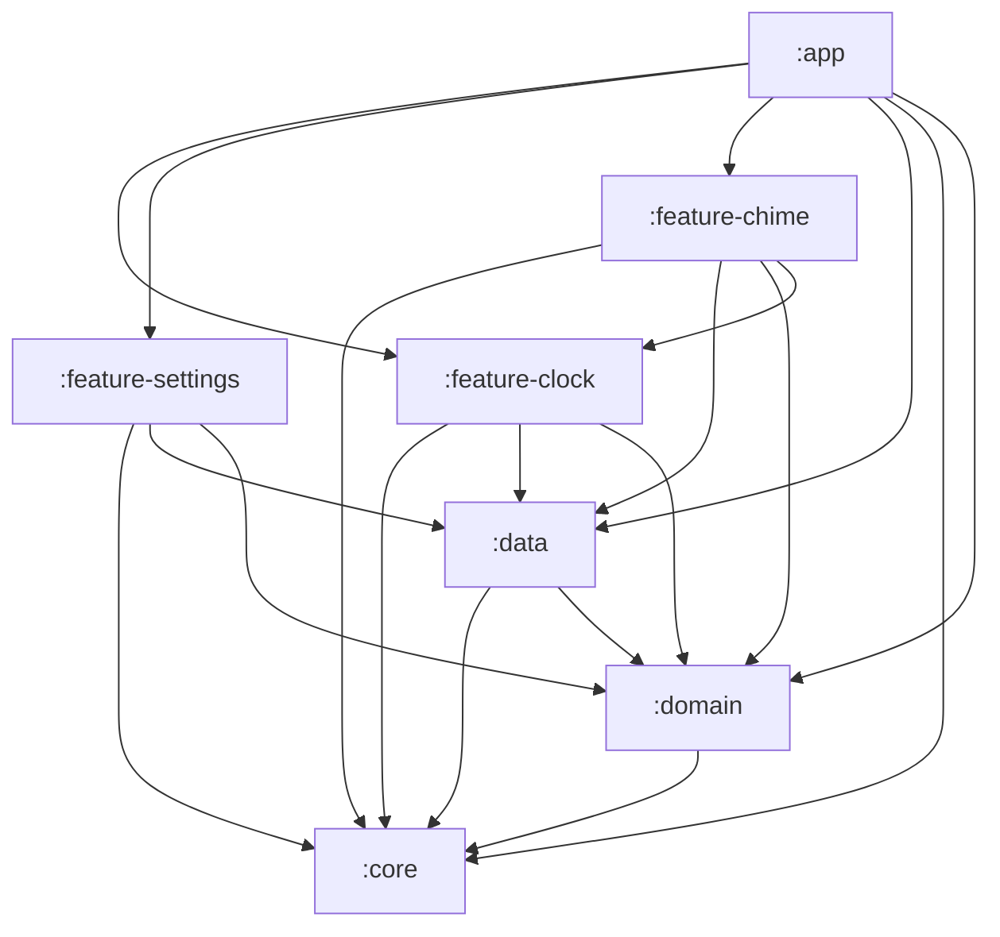

# OpenFlip Android - Technical Architecture

> **Version**: 0.6.0-beta | **Target SDK**: 35 | **Min SDK**: 26

---

## 1. Multi-Module Structure

```text
:app                          # Application entry point, DI, widgets, dream service
├── OpenFlipApplication.kt    # @HiltAndroidApp entry point
├── di/module/                # CoreModule, ManagerModule, ControllerModule
├── dream/                    # ScreensaverClockService (DreamService)
├── manager/                  # FeedbackSoundManager
└── widget/                   # WidgetClockBaseProvider + 5 widget variants

:core                         # Shared contracts, utilities (no Android framework deps beyond Context)
├── manager/                  # HapticFeedbackManager, Time
├── settings/                 # Settings, SettingsContracts, SettingsDefaults, SettingsHostController
└── util/                     # FontProvider, ThemeColorResolver, ViewExtensions

:domain                       # Pure business logic layer
├── gateway/                  # HourlyChimeScheduler, HourlyChimeTester
├── repository/               # SettingsRepository (interface)
├── result/                   # Result type
└── usecase/                  # 14 UseCases (ToggleTheme, StartSleepTimer, UpdateHapticEnabled, etc.)

:data                         # Data/persistence layer
├── repository/               # SettingsRepositoryImpl
├── settings/                 # AppSettingsManager, SettingsStore
└── util/                     # QuitGuard

:feature-clock                # Main clock UI feature
├── controller/               # SettingsCoordinator, SystemIntegration, TimeManagement, TimeTravel, UIState
├── manager/                  # AppLifecycleMonitor, DisplayBurnInProtection, LightEffect, TimeProvider, TimeTicker
├── ui/                       # FullscreenClockActivity, WindowConfigurator
├── view/                     # FullscreenFlipClockView, InfiniteKnobView, CircularTimerView, StateToggleGlowView
└── viewmodel/                # FullscreenClockViewModel, ClockUiState, ClockUiEvent

:feature-settings             # Settings UI feature
├── controller/               # HourlyChimeSettingsController
├── viewmodel/                # SettingsViewModel
└── res/                      # 30 drawable icons, shapes

:feature-chime                # Hourly chime scheduling feature
├── ChimeBootReceiver.kt, ChimeForegroundService.kt
├── ChimeScheduleUtils.kt, ChimeTestReceiver.kt
├── ChimeTimeChangeReceiver.kt, HourlyChimeManager.kt
└── HourlyChimeReceiver.kt
```

### Module Dependency Graph

```text
:core ← (no deps)
:domain ← :core
:data ← :core, :domain
:feature-clock ← :core, :data, :domain
:feature-chime ← :core, :data, :domain, :feature-clock
:feature-settings ← :core, :data, :domain
:app ← :core, :data, :domain, :feature-clock, :feature-chime, :feature-settings
```

---

## 2. Architectural Patterns

### 2.1 Interface-Based Decoupling

```
FullscreenClockActivity
    ├── implements SettingsProvider / ThemeTransitionProvider / SleepTimerDialogProvider
    └── implements OledProtectionController → SettingsMenuBottomSheet applies OLED mode
```

**Benefits**:

- `SettingsMenuBottomSheet` never directly depends on `FullscreenClockActivity`
- Testable with mock implementations
- Reduces coupling between UI components

### 2.2 Controller Split (Enforce Layer Responsibilities)

- **Business/System Controllers** (stay in `controller/`): coordinate settings/time/system integration; **must not hold View/ViewBinding or perform animations**; depend on interfaces exposed by Activities.
- **UI Controllers/Collaborators** (live in `ui/controller` or `ui/helper`): may hold View/ViewBinding and drive animations/gestures/window/state; keep lifecycle-safe checks and zero allocations in render paths.
- **View Layer Purity**: `view/` remains render-only; no imports from `ui/` or `widget/`; no ViewBinding references.
- When adding a new controller, decide upfront: if it touches UI/animations/gestures → place in `ui/controller`; if it coordinates state/business/system → place in `controller/` and keep it view-free.

#### SystemIntegrationController (current usage)

- **Owner**: constructed in `FullscreenClockActivity` and registered as a `LifecycleObserver`.
- **Role**: centralizes system-level behaviors (wake lock mode, burn-in protection, sleep/wake, persistent brightness).
- **Dependencies**: `AppCompatActivity`, `Window`, `SettingsStore`, `FullscreenClockViewModel`, `FullscreenFlipClockView`.
- **Delegation**: Activity implements `SleepTimerDialogProvider`/`OledProtectionController` and forwards calls to this controller.

### 2.3 Hilt Dependency Injection

```
di/module/
├── CoreModule.kt          # @Singleton: ApplicationContext, CoroutineScope, ElapsedTimeSource
├── ManagerModule.kt       # @Singleton: Vibrator, interface bindings (SettingsStore, HapticsProvider)
└── ControllerModule.kt    # Activity-scoped bindings
```

**Key patterns**: `@HiltAndroidApp`, `@AndroidEntryPoint`, `@HiltViewModel`, `@AssistedInject`.

### 2.4 UseCase Layer (`:domain`)

Each settings operation is encapsulated in a single-responsibility UseCase:

```kotlin
class ToggleThemeUseCase @Inject constructor(
    private val settingsRepository: SettingsRepository
) {
    suspend operator fun invoke(): Result<Unit>
}
```

14 UseCases cover all settings mutations, enforcing business rules before persistence.

### 2.5 Single Source of Truth

`AppSettingsManager` is the **only** place where user preferences are stored and read.

```kotlin
class AppSettingsManager(context: Context) : SettingsStore {
    private val prefs = context.applicationContext
        .getSharedPreferences("openflip_settings", Context.MODE_PRIVATE)
    
    override var isDarkTheme: Boolean
        get() = prefs.getBoolean(KEY_IS_DARK_THEME, DEFAULT_DARK_THEME)
        set(value) {
            prefs.edit().putBoolean(KEY_IS_DARK_THEME, value).apply()
            _settingsFlow.value = _settingsFlow.value.copy(isDarkTheme = value)
            _isDarkThemeFlow.value = value
            if (!suppressListeners) listener?.onThemeChanged(value)
        }
}
```

### 2.6 Separation of Concerns (FlipCard)

The flip card now follows clean architecture:

| Component | Responsibility |
|-----------|---------------|
| `FlipCardConfig` | Style constants (no magic numbers) |
| `FlipCardState` | Pure data + computed properties |
| `FlipCardGeometry` | Size/path calculations |
| `FlipCardRenderer` | Drawing only |
| `FlipCardComponent` | Facade for existing API |

### 2.7 Runtime Dependencies



---

## 3. Rendering Performance

### 3.1 Zero-Allocation onDraw

**Rules**:

- ❌ NEVER create `Paint()`, `Path()`, or `Rect()` in `onDraw()`
- ✅ Pre-allocate all objects at class level
- ✅ Use `path.reset()` for reuse

### 3.2 Path Pre-computation

```kotlin
// In setDimensions() - NOT in draw()
topClipPath.set(superellipsePath)
tempPath.addRect(topRect, Path.Direction.CW)
topClipPath.op(tempPath, Path.Op.INTERSECT)
```

### 3.3 Hardware Layer

```kotlin
setLayerType(LAYER_TYPE_HARDWARE, null)
```

**Why**: Prevents GPU resource reclaim causing black flash during rotation. Clear to `LAYER_TYPE_NONE` after animation (see AGENTS.md rules).

---

## 4. Rotation Anti-Flicker Protocol

### Manifest Configuration

```xml
<activity
    android:configChanges="orientation|screenSize|keyboardHidden|screenLayout"
    android:screenOrientation="fullSensor" />
```

### Theme Configuration

```xml
<!-- values/themes.xml (Light) -->
<item name="android:windowBackground">@color/white</item>

<!-- values-night/themes.xml (Dark) -->
<item name="android:windowBackground">@color/black</item>
```

**⚠️ CRITICAL**: Use hardcoded `@color/` references, NOT `?attr/` dynamic values (aligns with AGENTS.md hard rule).

---

## 5. Widget Architecture

```text
WidgetClockBaseProvider (abstract)
    ├── layoutId: Int (abstract) → Points to layout resource
    └── updateAppWidget() → Called on update/resize

TextClock (system-level time sync)
    ├── format12Hour="h" / format24Hour="HH"
    └── Automatic time updates without AlarmManager
```

**Split Effect**: 120dp TextClock in 59dp container with `clipChildren="true"`.

---

## 6. Dependency Rules

1. **Module boundaries enforced**: `checkModuleBoundaries` Gradle task validates allowed inter-module deps at build time.
2. **SharedPreferences isolation**: `checkSharedPreferencesIsolation` ensures only `:data` uses `SharedPreferences`.
3. **Resource ownership**: `checkResourceOwnershipBoundaries` / `checkResourceSymbolBoundaries` prevent duplicate resources between `:app` and `:feature-settings`.
4. **No circular deps**: `view/` within `:feature-clock` MUST NOT import from `ui/` or widget packages.
5. **Interface boundaries**: Cross-module access via small interfaces (e.g., `SettingsHostController`, `SettingsContracts`) in `:core`.
6. **Settings hub**: All prefs access flows through `AppSettingsManager` in `:data` (via `SettingsStore` interface).
7. **Widgets isolated**: RemoteViews providers in `:app` only use widget-safe resources/layouts.
8. **Compose scope**: Compose limited to settings components; primary clock remains XML + custom Views.
