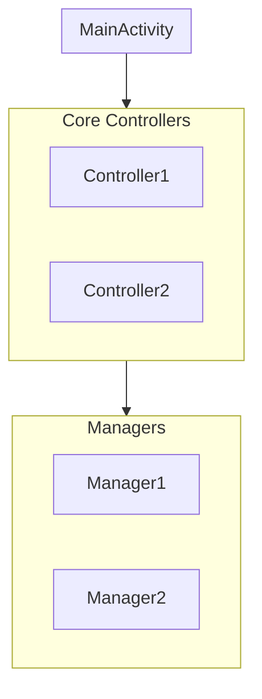

# README Architecture Sync

**Purpose**: Keep README.md architecture documentation accurate and in sync with the actual codebase.

## When to Use

- After refactoring or adding new components (Controllers, Managers, etc.)
- When user asks to update README architecture section
- When verifying if documentation matches actual code
- Before releases to ensure documentation accuracy

## Workflow

### Step 1: Scan Codebase Components

Identify all architectural components by scanning the source directory:

```bash
# List all Kotlin/Java files
find ./app/src/main/java -type f \( -name "*.kt" -o -name "*.java" \) | sort
```

Look for files matching these naming patterns:

| Pattern | Category |
|---------|----------|
| `*Controller.kt` | Controllers (Core or UI) |
| `*Manager.kt` | Managers |
| `*Coordinator.kt` | Coordinators |
| `*Configurator.kt` | Collaborators |
| `*Applier.kt` | Collaborators |
| `*Router.kt` | Collaborators |
| `*Handler.kt` | Handlers |

### Step 2: Categorize Components

Group discovered components into layers:

| Layer | Responsibility | Example Classes |
|-------|---------------|-----------------|
| **Core Controllers** | Business logic, state management | `SettingsCoordinator`, `TimeManagementController` |
| **UI Controllers** | User interaction patterns | `ThemeToggleController`, `KnobInteractionController` |
| **Managers** | Resource lifecycle, effects | `FeedbackSoundManager`, `HapticFeedbackManager` |
| **UI Collaborators** | Focused UI concerns | `WindowConfigurator`, `ThemeApplier`, `GestureRouter` |

### Step 3: Read Current README

Read the README.md file and locate the architecture section (typically "Structural Design" or "Architecture").

### Step 4: Compare and Identify Gaps

Create a comparison table:

```markdown
| Component | In README | In Codebase | Action |
|-----------|-----------|-------------|--------|
| WindowConfigurator | ✅ | ✅ | Keep |
| NewManager | ❌ | ✅ | Add |
| OldHelper | ✅ | ❌ | Remove |
| RenamedClass | ❌ (old name) | ✅ | Update |
```

### Step 5: Update README

#### 5.1 Fix Incorrect Names

If a component was renamed in code but README has the old name:

```markdown
# Before
| **`BurnInManager`** | Panel Protection | ...

# After  
| **`DisplayBurnInProtectionManager`** | Panel Protection | ...
```

#### 5.2 Add Missing Components

Add new components to the appropriate table with description:

```markdown
| **`NewController`** | [Brief responsibility description] |
```

#### 5.3 Remove Obsolete Components

Remove components that no longer exist in the codebase.

#### 5.4 Update Architecture Diagram

If using Mermaid diagrams, update to reflect current structure:



## Output Format

After completing the sync, provide a summary:

```markdown
## Architecture Sync Summary

**Files Scanned**: X
**Components Found**: Y

### Changes Made
- ✅ Fixed: `OldName` → `NewName`
- ✅ Added: `NewController` to Core Controllers section
- ✅ Removed: `ObsoleteManager` (no longer in codebase)
- ✅ Updated: Mermaid diagram with new components

### Verification
All N components in README now match actual codebase.
```

## Verification Checklist

Before completing, verify:

- [ ] All component names in README exist in codebase
- [ ] All major components in codebase are documented
- [ ] Mermaid diagram (if present) reflects current architecture
- [ ] Component descriptions are accurate
- [ ] No typos in class names (case-sensitive)

## Best Practices

1. **Preserve existing descriptions** - Only update names, don't rewrite descriptions unless incorrect
2. **Match casing exactly** - `DisplayBurnInProtectionManager` not `displayBurnInProtectionManager`
3. **Keep tables consistent** - Use same format as existing tables in README
4. **Update diagrams** - Don't forget Mermaid/PlantUML diagrams
5. **Document rationale** - If removing components, note why (renamed vs deleted)

## Anti-Patterns

- ❌ Adding components that don't exist in code
- ❌ Using abbreviated names different from actual class names
- ❌ Leaving outdated component names after refactoring
- ❌ Documenting internal/private classes in public README
