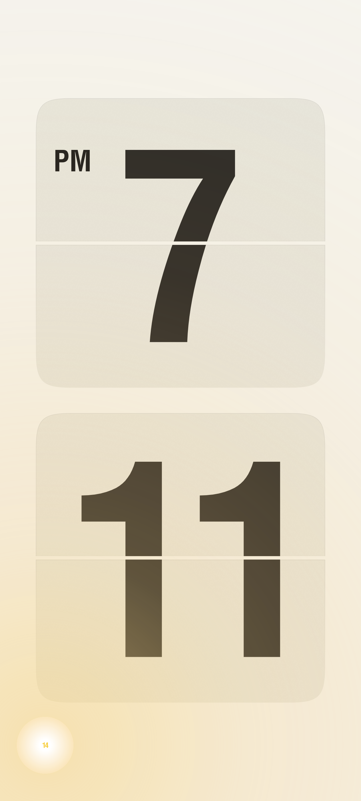
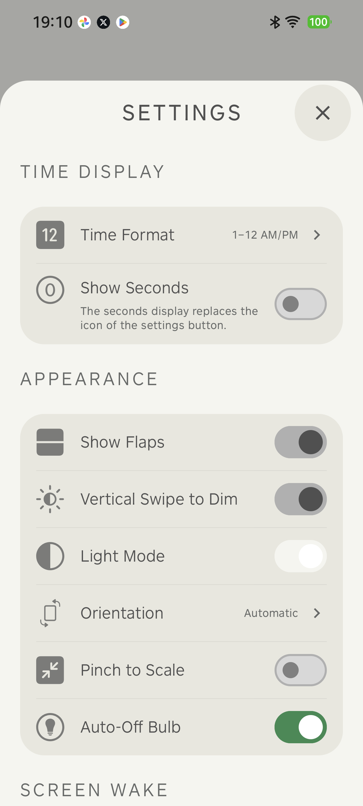
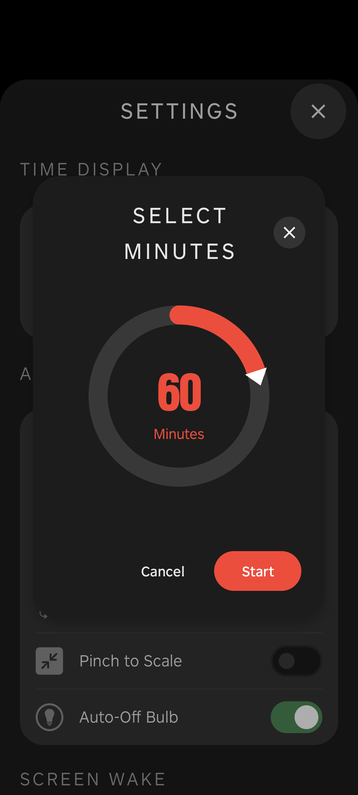
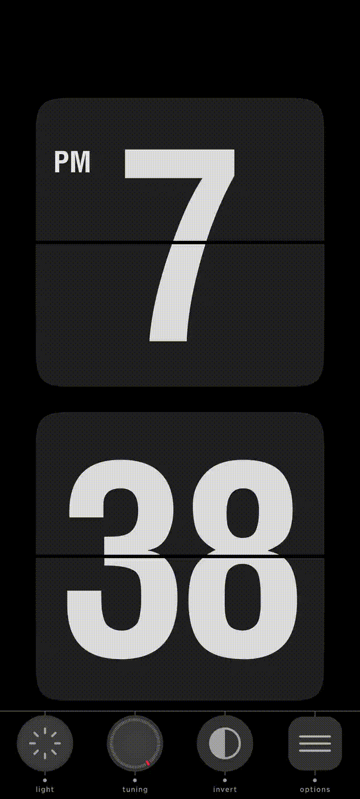
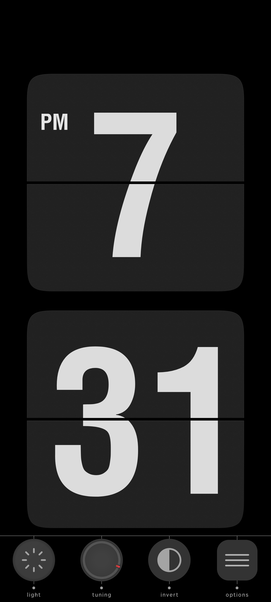

# OpenFlip (Android)

[](https://github.com/YOUR_USERNAME/fliqlo_android/actions/workflows/android.yml)

[中文文档 (Simplified Chinese)](README.zh-CN.md)

OpenFlip is a Braun-inspired flip clock for Android, focusing on mechanical animation fidelity, visual precision, and maintainable architecture.

Key features:
- **Custom rendering engine**: Physics-based flip animations using `Canvas` + 3D transforms
- **Pixel-perfect layout**: Precise text positioning and light-overlay compensation across all screen densities
- **Modular architecture**: Hilt DI + multi-module layering for performance and extensibility

## Highlights

- Realistic card-flip animation with custom `Canvas` + 3D transform pipeline.
- Minimalist full-screen clock UI with tactile controls.
- **Zero-drain background behavior**: Stops all rendering and activity when not visible.
- **Polished Settings Sheet**: 72% initial height, smooth gestures, and seamless transitions.
- Hybrid UI stack:
  - Jetpack Compose for settings screens.
  - Custom Views for high-performance clock rendering.
- OLED burn-in protection with subtle pixel shifting.
- Light overlay effect with translation compensation (no edge gaps during burn-in shift).
- Hilt-based dependency injection with compile-time graph validation.

## Table of Contents

- [Screenshots](#screenshots)
- [Project Structure](#project-structure)
- [Tech Stack](#tech-stack)
- [Quick Start](#quick-start)
- [Build and Development Commands](#build-and-development-commands)
- [Architecture](#architecture)
- [Dependency Injection (Hilt)](#dependency-injection-hilt)
- [Key Runtime Components](#key-runtime-components)
- [Testing and Verification](#testing-and-verification)
- [Performance Notes](#performance-notes)
- [Recent Maintenance (2026-02)](#recent-maintenance-2026-02)
- [Contributing](#contributing)
- [License](#license)

## Screenshots

Captured from a real connected Android device via ADB.

### Fullscreen Clock


### Light Effect Enabled



### Dark Theme + Light Effect


### Settings Sheet (Compose)



### Sleep Timer Dialog



### Seconds Display Enabled


### Dark Theme Light Bulb Toggle (GIF)



### Seconds Ticking (GIF)


### Knob Rotation Interaction



### Vertical Dim Demo (GIF)


### Knob Rotation 2000° (GIF)


## Project Structure

```text
OpenFlip/
├── app/                 # Android app entry, DI modules, resources
├── core/                # Shared contracts/models/utilities
├── data/                # Repository implementations and persistence
├── domain/              # Use cases and repository interfaces
├── feature-clock/       # Clock runtime, custom view engine, activity/controllers
├── feature-settings/    # Settings UI (Compose), settings ViewModel/controllers
├── feature-chime/       # Hourly chime feature
└── docs/                # Architecture notes, ADRs, regression baseline
```

## Tech Stack

- Language: Kotlin
- UI:
  - Jetpack Compose (settings and modern UI components)
  - Custom Views (clock rendering, interactive 3D controls)
- Architecture: MVVM + reactive `StateFlow` + Hilt DI
- Major dependencies:
  - Hilt `2.55`
  - Material Components / Material 3
  - Cloudy (liquid-glass blur effects)

## Quick Start

### Requirements

- JDK 17+
- Android Studio Ladybug or newer
- Android SDK configured locally

### Clone and Run

```bash
# Replace with your actual repository URL
git clone https://github.com/<your-username>/fliqlo_android.git
cd fliqlo_android
./gradlew installDebug
```

If dependencies or DI setup changed, run a clean build once:

```bash
./gradlew clean build
```

## Build and Development Commands

```bash
# Install debug APK to connected device/emulator
./gradlew installDebug

# Run unit tests
./gradlew test

# Static analysis
./gradlew lint

# Validate full compile graph (including Hilt)
./gradlew build
```

## Architecture

OpenFlip uses modular clean boundaries with feature-focused runtime orchestration.

### Modules

- `:app`: Android entry points, DI composition, resources.
- `:core`: Common contracts, models, shared utilities.
- `:domain`: Use cases and repository contracts.
- `:data`: Repository implementations and `AppSettingsManager` persistence.
- `:feature-clock`: Fullscreen clock runtime, rendering, interaction controllers.
- `:feature-settings`: Settings UI and settings state flow.
- `:feature-chime`: Hourly chime behavior.

### Data/State Direction

`UI -> ViewModel -> Repository -> SettingsStore(AppSettingsManager)`

Clock runtime (`feature-clock`) observes settings flow and applies UI/runtime diffs reactively.

### Architecture References

- Baseline: `docs/architecture-baseline.md`
- ADRs: `docs/adr/`

## Dependency Injection (Hilt)

Hilt replaced manual wiring for compile-time safety and cleaner lifecycle scoping.

### DI Layout

```text
app/src/main/java/com/bokehforu/openflip/
├── OpenFlipApplication.kt          # @HiltAndroidApp
└── di/module/
    ├── CoreModule.kt               # Context, CoroutineScope, time utilities
    ├── ManagerModule.kt            # Manager/interface bindings
    └── ControllerModule.kt         # Activity-scoped bindings
```

### Commonly Injected Types

- `AppSettingsManager` (`@Singleton`)
- `HapticFeedbackManager` (`@Singleton`)
- `FeedbackSoundManager` (`@Singleton`)
- `TimeProvider` (`@Singleton`)
- `FullscreenClockViewModel` (`@HiltViewModel`)
- `SettingsViewModel` (`@HiltViewModel`)
- `LightToggleController` (AssistedInject + Factory)

## Key Runtime Components

### Clock and Rendering

- `feature-clock/src/main/java/com/bokehforu/openflip/feature/clock/view/FullscreenFlipClockView.kt`
  - Main custom view for card flip rendering.
- `feature-clock/src/main/java/com/bokehforu/openflip/feature/clock/view/renderer/LightOverlayRenderer.kt`
  - Light overlay rendering with full-coverage compensation.
- `feature-clock/src/main/java/com/bokehforu/openflip/feature/clock/manager/DisplayBurnInProtectionManager.kt`
  - OLED shift manager with custom shift applier callback.

### Activity and Controllers

- `feature-clock/src/main/java/com/bokehforu/openflip/feature/clock/ui/FullscreenClockActivity.kt`
- `feature-clock/src/main/java/com/bokehforu/openflip/feature/clock/ui/controller/LightToggleController.kt`

### Settings and Persistence

- `feature-settings/src/main/java/com/bokehforu/openflip/feature/settings/viewmodel/SettingsViewModel.kt`
- `data/src/main/java/com/bokehforu/openflip/data/settings/AppSettingsManager.kt`

## Testing and Verification

### Automated Checks

- Unit tests: `app/src/test`
- Build-time DI graph verification: `./gradlew build`
- Custom Gradle verification tasks (run automatically during `check`):
  - `checkModuleBoundaries` — Enforces allowed module dependency graph.
  - `checkSharedPreferencesIsolation` — Ensures `SharedPreferences` usage is confined to `:data`.
  - `checkResourceOwnershipBoundaries` — Detects duplicate resource paths between `:app` and `:feature-settings`.
  - `checkResourceSymbolBoundaries` — Detects duplicate resource symbols across modules.
  - `checkAppResourceReferenceBoundaries` — Prevents `:app` from referencing `:feature-settings`-owned resources.
  - `checkNoFeatureSettingsRUsageInApp` — Blocks direct `:feature-settings` R imports in `:app`.
- Recommended local gate before PR:

```bash
./gradlew test lint build
```

### Manual Verification Checklist

- Verify flip animations across portrait/landscape.
- Verify dark/light theme transitions in settings.
- Verify OLED protection subtle shifts while keeping visual continuity.
- Verify light overlay with OLED protection enabled (no edge gaps).
- Verify haptic feedback on all buttons.
- Verify only the Light button triggers sound effect.

## Performance Notes

- Clock rendering path is optimized for smooth 60fps behavior.
- Avoid allocations inside `onDraw` hot paths.
- Cache expensive text/theme/noise rendering resources where possible.
- Keep Compose and custom rendering concerns separated to minimize regressions.

## Recent Maintenance (2026-02)

- Settings Sheet refinement:
  - Default 72% height with smooth expansion to fullscreen.
  - Improved gesture handling (drag-to-dismiss, scroll synchronization).
- Power optimization:
  - Zero background activity when screen off or app hidden.
- App Shortcuts:
  - Fixed shortcuts for Dark/Light mode and Settings.
- Documentation:
  - Added Chinese (Simplified) README (`README.zh-CN.md`).
- Replaced `app/src/main/res/raw/flip_sound.mp3`.
- Rebalanced audio levels (flip softer, chime slightly louder).
- Cached theme background color in `FullscreenFlipClockView`.
- Accessibility updates:
  - Clock announces current time.
  - Light button announces on/off and is clickable.
- Text rendering optimization:
  - Added LRU cache for ink-center calculations (digits + AM/PM).
- Flip renderer optimization:
  - Noise shader caching in `FlipCardRenderer` to reduce GC during theme changes.
- Gesture safety update:
  - Brightness dim only on single-finger scroll.
  - Multi-finger pinch no longer triggers dim.
- Light overlay rendering:
  - Removed PorterDuff `ADD` to avoid GPU-to-software fallback.
- Bug Fixes:
  - Resolved Sleep Timer crash.
  - Fixed Invert button sound feedback.

## Contributing

### Branching

- Use feature branches from `main`.
- Keep each PR scoped to one behavior or refactor goal.

### PR Checklist

- Keep module boundaries intact (`docs/architecture-baseline.md`).
- Include tests or rationale for test gaps.
- Run local quality gates:

```bash
./gradlew test lint build installDebug
```

- Update docs when changing architecture, behavior, or user-facing settings.

### Commit Guidance

- Follow [Conventional Commits](https://www.conventionalcommits.org/) (`feat:`, `fix:`, `refactor:`, `docs:`, `chore:`, etc.).
- Prefer small, reviewable, atomic commits.
- Use clear commit subjects describing behavioral impact.

## License

This project's code and design resources are provided under the following terms:

- **License Grant**: Completely free for personal learning, educational research, and non-profit open-source communities. You are free to access, modify, and distribute the source code.
- **Commercial Restrictions**: Any form of commercial exploitation is **strictly prohibited**. This includes but is not limited to:
  - Publishing or selling this project or its derivatives on any app store.
  - Integrating ads, in-app purchases, or other profit-making plugins.
  - Using this project as part of paid courses, commercial outsourcing, or paid software.
- **Share Alike**: Any modified versions or derivative works must inherit this agreement and remains open-source under the same non-commercial restrictions.

For more details, see [CC BY-NC-SA 4.0](https://creativecommons.org/licenses/by-nc-sa/4.0/).
