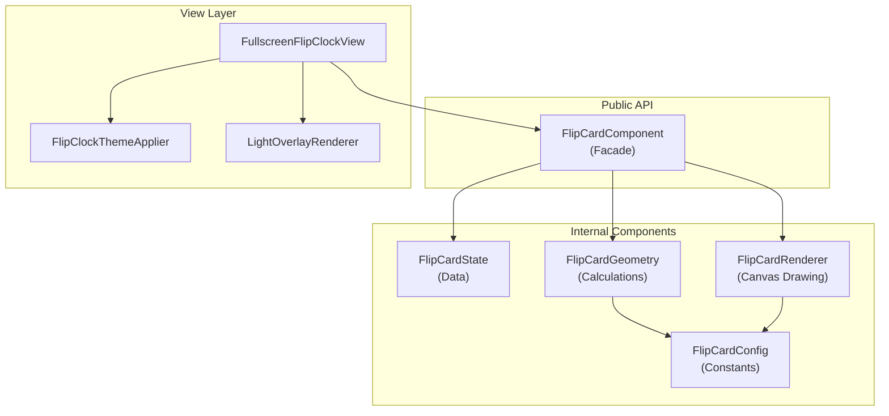
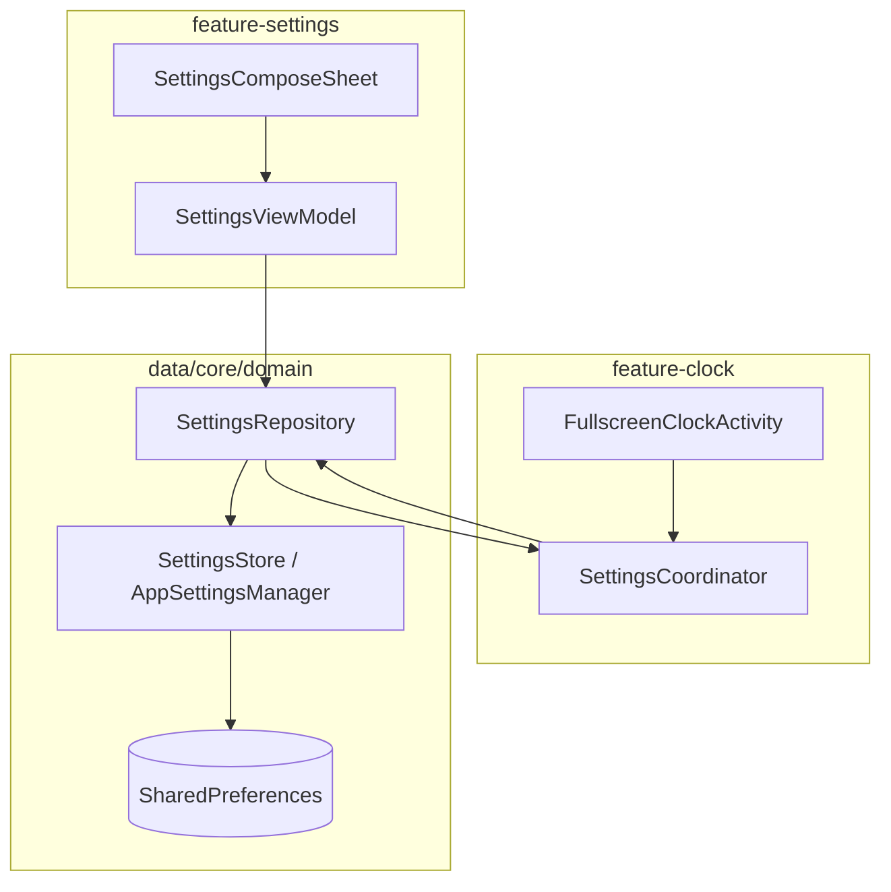
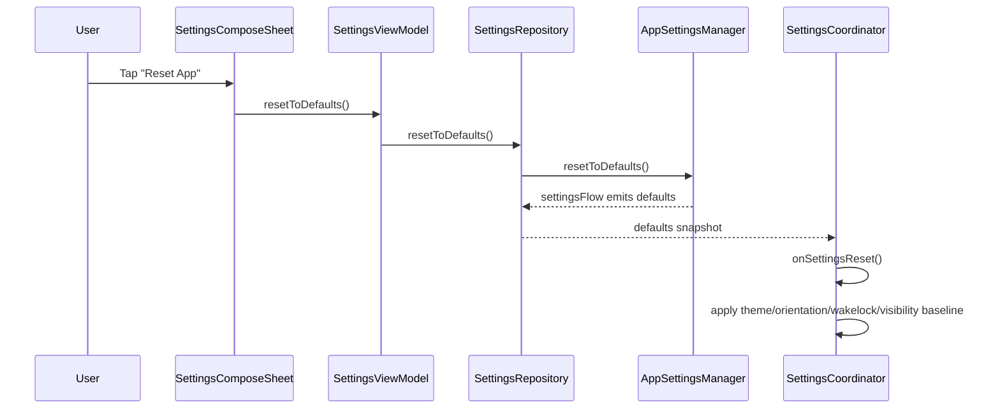

# OpenFlip Android: Technical Documentation & specification

OpenFlip for Android is a high-performance, minimalist reconstruction of the classic mechanical flip clock. This project prioritizes **physical authenticity**, **visual precision**, and **architectural scalability**, providing a premium time-keeping experience for both full-screen use and home screen integration.

---

## 1. High-Fidelity Rendering Architecture

The visual engine is the heart of OpenFlip. It bypasses conventional high-level layout constraints to achieve low-latency, 60fps animations through a custom-built graphics pipeline.

### 1.1 The Mathematics of a Flip

The animation is not a simple sprite swap. It is a mathematical model of a folding card:

- **Perspective Projection**: Utilizes `android.graphics.Camera` for 3D rotation around the X-axis. A fixed perspective depth is applied to simulate the observer's distance from the mechanical flap.
- **Dual-Pane Clipping**: Each digit is rendered in two halves (upper and lower). The "flip" involves rotating the top half of the *next* digit 180 degrees down while simultaneously rotating the bottom half of the *current* digit out of view.
- **Pivot Point Calibration**: The rotation pivot is placed precisely at the horizontal centerline of the clock card to ensure geometric continuity during the transition.
- **Shadow Mapping**: Real-time calculation of "crease shadows" where the intensity of the center shadow varies proportionally to the flap angle, enhancing the 3D effect.

### 1.2 Optical Centering Algorithm (Ink-Logic)

Standard bounding-box centering often feels "wrong" because characters have different visual weights. OpenFlip implements a per-character ink-center calculation:

- **Algorithm**: `Paint.getTextBounds()` is called to retrieve the exact pixel-occupied rectangle.
- **Offset Calculation**: Instead of baseline centering, we calculate `(textBounds.left + textBounds.right) / 2` to find the horizontal "ink center" and align it with the card's geometric center.
- **Result**: "1" and "8" appear perfectly balanced, even if their glyph widths differ by 300%.

---

## 2. Resource & Memory Stewardship

### 2.1 Zero-Allocation Drawing Loop

In accordance with high-performance Android graphics standards, the `onDraw` method of `FullscreenFlipClockView` and its sub-renderers contains **zero object allocations**:

- **Pre-cached Objects**: All `RectF`, `Paint`, `Matrix`, and `Path` objects are calculated once during initialization or layout changes.
- **No GC Pressure**: This ensures that even during high-frequency updates (seconds display), there are zero Garbage Collection stutters, maintaining a consistent 16.6ms frame time.

### 2.2 Battery & Power management

- **Dynamic Framerate**: When the seconds display is disabled, the drawing loop remains completely idle until the next minute update.
- **Wakelock Scalability**:
  - **System Default**: Standard system screen timeout logic.
  - **Interactive Keep-Alive**: Uses `FLAG_KEEP_SCREEN_ON` only when the app is in the foreground and active.
  - **Selective Throttling**: Reduces rendering updates when battery level is below 15% (planned).

---

## 3. Flip Card Rendering System

The flip card rendering is architected using a multi-layer separation of concerns pattern, enabling independent testing and modification of each aspect.

### 3.1 Component Architecture



### 3.2 Component Responsibilities

| Component | Location | Responsibility |
| :--- | :--- | :--- |
| **`FlipCardComponent`** | `view/card/` | Public facade exposing `currentValue`, `nextValue`, `flipDegree`, `amPmText` |
| **`FlipCardState`** | `view/card/` | Immutable data holder for flip animation state |
| **`FlipCardGeometry`** | `view/card/` | Size/shape calculations, pivot points, clip regions |
| **`FlipCardRenderer`** | `view/card/` | Canvas drawing operations, 3D transforms, shadow rendering |
| **`FlipCardConfig`** | `view/card/` | Animation constants (duration, easing, shadow intensity) |

### 3.3 Custom Views

| View | Location | Purpose |
| :--- | :--- | :--- |
| **`FullscreenFlipClockView`** | `view/` | Main clock view, orchestrates hour/minute `FlipCardComponent` instances |
| **`InfiniteKnobView`** | `ui/view/` | Rotatable knob for time travel feature |
| **`StateToggleGlowView`** | `ui/view/` | Light toggle button with animated glow effect |
| **`CircularTimerView`** | `ui/view/` | Circular progress indicator for sleep timer |

### 3.4 Design Benefits

- **Testability**: `FlipCardGeometry` can be unit tested without Android dependencies
- **Reusability**: `FlipCardRenderer` can be reused for different card sizes
- **Maintainability**: Changes to animation timing only affect `FlipCardConfig`
- **Performance**: Pre-calculated geometry avoids runtime allocations

---

## 4. Structural Design: Feature-Module Collaborator Pattern

`FullscreenClockActivity` remains intentionally thin and delegates behavior to focused collaborators across feature modules.

### 4.1 Runtime Package Structure (Current)

```
:feature-clock (com.bokehforu.openflip.feature.clock)
├── controller/              # Core feature logic orchestration
│   ├── SettingsCoordinator
│   ├── SystemIntegrationController
│   ├── TimeManagementController
│   ├── TimeTravelController
│   └── UIStateController
├── manager/                 # Feature runtime managers
│   ├── AppLifecycleMonitor
│   ├── DisplayBurnInProtectionManager
│   ├── LightEffectManager
│   ├── TimeProvider
│   └── TimeSecondsTicker
├── ui/
│   ├── FullscreenClockActivity
│   ├── WindowConfigurator
│   ├── helper/              # GestureRouter, WaterfallAnimationHelper, SystemBarStyleHelper
│   ├── controller/          # Knob/Light/Theme/SleepWake/Factory/StateCollector
│   ├── compose/             # MainOptionsButton and visual Compose primitives
│   ├── dialog/              # SleepTimerDialogManager
│   ├── theme/
│   └── transition/
├── view/                    # FullscreenFlipClockView and card rendering internals
└── viewmodel/               # FullscreenClockViewModel

:feature-settings (com.bokehforu.openflip.feature.settings)
├── ui/settings/             # SettingsComposeSheet, main list scaffold, subpages
├── ui/compose/              # Reusable settings list items/pages
├── ui/theme/
├── viewmodel/               # SettingsViewModel
└── controller/              # HourlyChimeSettingsController
```

### 4.2 High-Level Collaboration

```mermaid
graph TB
    Activity[FullscreenClockActivity]
    Factory[FullscreenClockControllersFactory]
    ClockCtrl[feature-clock controllers]
    SettingsUI[SettingsComposeSheet]
    SettingsVM[SettingsViewModel]
    Repo[SettingsRepository]
    Store[AppSettingsManager(SettingsStore)]

    Activity --> Factory
    Factory --> ClockCtrl
    Activity --> SettingsUI
    SettingsUI --> SettingsVM
    SettingsVM --> Repo
    ClockCtrl --> Repo
    Repo --> Store
```

### 4.3 Core Controllers (`feature-clock/controller/`)

| Controller | Responsibility |
| :--- | :--- |
| **`SettingsCoordinator`** | Collects `settingsFlow`, applies setting diffs to clock UI/controllers |
| **`SystemIntegrationController`** | OLED protection, wake lock handling, sleep timer dialog integration |
| **`TimeManagementController`** | Time updates, minute/seconds flow handling, format-aware rendering |
| **`TimeTravelController`** | Virtual time offset and knob-driven time travel |
| **`UIStateController`** | Interaction-state visibility and divider/spine presentation logic |

### 4.4 UI Controllers (`feature-clock/ui/controller/`)

| Controller | Responsibility |
| :--- | :--- |
| **`KnobInteractionController`** | Knob input and time-travel interaction bridge |
| **`LightToggleController`** | Light state toggle + countdown interaction |
| **`ThemeToggleController`** | Theme change requests and transition coordination |
| **`SleepWakeController`** | Sleep timer wake behavior and burn-in manager lifecycle coupling |
| **`ShortcutIntentHandler`** | App shortcut actions (theme/seconds/settings) |
| **`FullscreenClockStateCollector`** | Lifecycle-aware UI state collection and render callbacks |
| **`FullscreenClockControllersFactory`** | Centralized creation/cleanup for controller graph |

### 4.5 Settings UI Composition (`feature-settings/ui/settings/`)

| Component | Responsibility |
| :--- | :--- |
| **`SettingsComposeSheet`** | Bottom-sheet host, page routing, host callback wiring |
| **`SettingsMainListScaffold`** | Main settings list sections and spacing/layout |
| **`SettingsSubPages`** | Time format, orientation, wake lock, sleep timer pages |
| **`SettingsPrimarySections` / `SettingsSecondarySections`** | Main-page item groups and toggle/navigation actions |
| **`SettingsSectionHeader`** | Section title typography + spacing tokenization |

### 4.6 Interface Segregation (`core/settings`)

`FullscreenClockActivity` exposes focused contracts used by settings/clock controllers:

| Interface | Purpose |
| :--- | :--- |
| **`OledProtectionController`** | Toggle OLED burn-in protection |
| **`SleepTimerDialogProvider`** | Open standard/custom sleep timer dialogs |
| **`ThemeTransitionProvider`** | Request theme transitions |
| **`SettingsHostController`** | Sleep timer state + settings click/interacting callbacks |

This keeps dependencies capability-based and avoids broad Activity coupling.

---

## 5. AppWidget Infrastructure

OpenFlip provides 5 distinct widget types, each utilizing a specialized `RemoteViews` adapter architecture:

1. **Classic**: High-contrast black/white mechanical aesthetic.
2. **Glass**: Utilizes `RenderEffect` compatible styles for a frosted glass look (requires API 31+ fallback for older versions).
3. **Minimal**: Borderless, whitespace-optimized rendering.
4. **Solid**: Dense, block-based UI for maximum legibility at small scales.
5. **Split**: Separated hour/minute blocks for flexible home screen layouts.

**Technical Constraint**: Due to `RemoteViews` anti-aliasing in `Canvas` rendering, some widget styles may show a 1px artifact in the center gap. This is a known OS-level limitation with no stable workaround.

---

## 6. Settings Architecture

Settings now follow a fully reactive flow: Compose UI -> ViewModel -> Repository -> Store, with clock-side observers applying changes.

### 6.1 Core Components



| Component | Responsibility |
| :--- | :--- |
| **`SettingsComposeSheet`** | User-facing settings pages and actions (main + subpages) |
| **`SettingsViewModel`** | Dispatches settings updates via domain use cases and exposes UI StateFlows |
| **`SettingsRepository`** | Domain-facing read/write abstraction for settings |
| **`AppSettingsManager`** | `SettingsStore` implementation backed by `SharedPreferences` + `settingsFlow` |
| **`SettingsCoordinator`** | Applies settings diffs to `FullscreenFlipClockView`, wake lock, theme, UI visibility |

### 6.2 Reset-to-Defaults Flow



### 6.3 Reactive Application Pattern

Clock-side settings application is flow-driven rather than listener-interface-driven:

```kotlin
settingsRepository.settingsFlow.collect { settings ->
    applyDiff(previous, settings)
}
```

This keeps settings propagation deterministic across configuration changes and module boundaries.

---

## 7. Data Persistence & State Schema

Settings are managed via a reactive `AppSettingsManager` wrapper around `SharedPreferences`.

### 7.1 Settings Matrix (11 Core Keys)

| Key | Type | Objective |
| :--- | :--- | :--- |
| `time_format_mode` | Int | 0 = 12h, 1 = 24h format. |
| `is_show_seconds` | Bool | Toggles high-frequency flip animation. |
| `is_show_flaps` | Bool | Toggles the visual card border visibility. |
| `is_swipe_to_dim` | Bool | Enables dynamic brightness adjustment via gestures. |
| `is_haptic_enabled` | Bool | Triggers feedback via `HapticFeedbackManager`. |
| `is_sound_enabled` | Bool | Plays mechanical flip audio samples. |
| `is_dark_theme` | Bool | Master switch for UI theming. |
| `orientation_mode` | Int | Lock/Unlock rotation behavior. |
| `oled_protection` | Bool | Activates the `DisplayBurnInProtectionManager`. |

---

## 8. Development Workflow

### 8.1 Coding Standards

- **Naming Protocol**: Drawables must follow `[type]_[usage]_[description]_[size]dp.xml`.
- **Style Enforcement**: All colors must be semantic (e.g., `bg_primary` instead of `black`).
- **Null Safety**: Strict enforcement of Kotlin null-safety, especially in `RemoteViews` adapters where context may be volatile.

### 8.2 Verification Command Suite

- **Full Build**: `./gradlew assembleRelease`
- **Lint Check**: `./gradlew lint`
- **UI Audit**: Use the custom `/deploy` workflow to capture automated multi-orientation screenshots.

---

## 9. Roadmap & Historical Decisions

### Why no AOD (Always-On Display)?

AOD was deliberately excluded due to the lack of a standardized Android API. Vendor-specific implementations (Samsung AOD, MIUI Screen Saver) introduce high fragmentation that compromises project stability.

### Upcoming Milestones

- **Support for custom .ttf fonts** for clock digits.
- **Material You Dynamic Color** integration for themed widgets.
- **TalkBack/Accessibility** specialized rendering descriptions.

---

*This project is developed using an Agentic AI workflow. For internal architecture notes, refer to `.agent/AGENTS.md`.*
